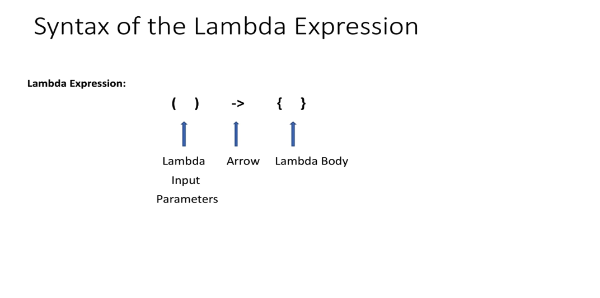

### Extracted Text:

**What is Lambda Expression?**

- Lambda is equivalent to a function (method) without a name.
- Lambdas are also referred to as **Anonymous functions**.
  - Method parameters
  - Method Body
  - Return Type
- Lambdas are not tied to any class like a regular method.
- Lambdas can also be assigned to variables and passed around.

Lambda Expression
```
    (   )           ->              {    }
      ↑             ↑                 ↑
Lambda Input    Arrow          Lambda Body
Parameters
```
Usages of Lambda
### Extracted Text:

**Usages of Lambda**

- Lambda is mainly used to implement Functional Interfaces (SAM).
SAM - Single Abstract Method

```java
@FunctionalInterface
public interface Comparator<T> {
    int compare(T o1, T o2);
}
```

```java
@FunctionalInterface
public interface Runnable {
    public abstract void run();
}
```