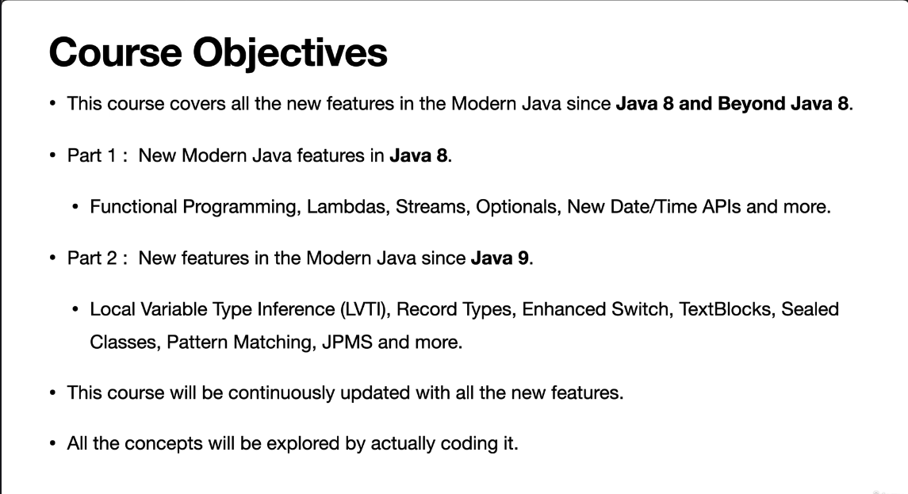
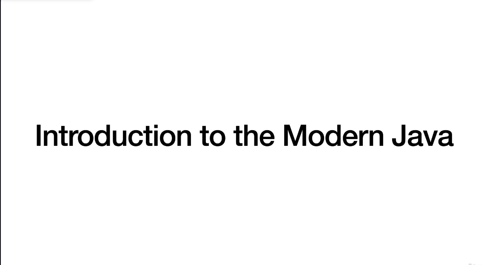
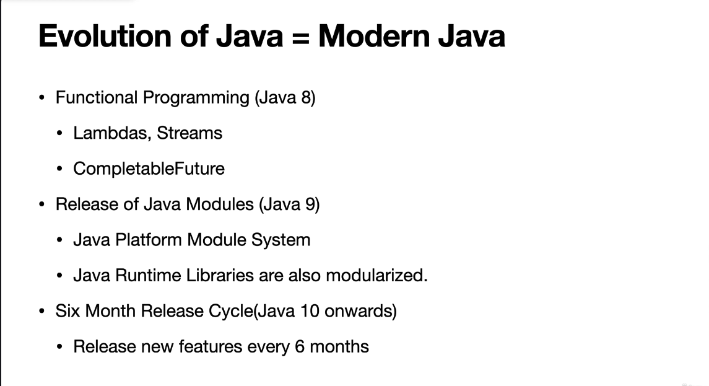
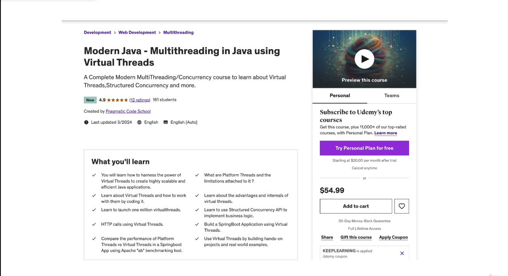

# Java-8-to-Java-21
https://gale.udemy.com/course/modern-java-learn-java-8-features-by-coding-it -  Modern Java: Mastering Features from Java 8 to Java 21



The text extracted from the image is as follows:

---

**Course Objectives**

- This course covers all the new features in the Modern Java since Java 8 and Beyond Java 8.
- Part 1: New Modern Java features in Java 8.
  - Functional Programming, Lambdas, Streams, Optionals, New Date/Time APIs and more.
- Part 2: New features in the Modern Java since Java 9.
  - Local Variable Type Inference (LVTI), Record Types, Enhanced Switch, TextBlocks, Sealed Classes, Pattern Matching, JPMS and more.
- This course will be continuously updated with all the new features.
- All the concepts will be explored by actually coding it.

--- 

This text outlines the objectives of a course focused on modern Java features.

Targeted Audience

Experienced Java Developers.
Java Developers who are interested in exploring the latest features in Java.
Java Developers who like to stay up to date.
Hands-On Oriented course.
This text describes the target audience for a course, focusing on experienced and motivated Java developers.

The text extracted from the image is as follows:

---

**Targeted Audience**

- Experienced Java Developers.
- Java Developers who are interested in exploring the latest features in Java.
- Java Developers who like to stay up to date.
- Hands-On Oriented course.

--- 

This text describes the target audience for a course, focusing on experienced and motivated Java developers.


### Extracted Text from the Images:

---

#### **Prerequisites**
- Java 21 or above.
- Prior Java Experience is a must.
- IntelliJ or any other IDE.
- Experience Writing JUnit tests.
- Additional Tools and Skills:
  - Git
  - Experience working with Gradle (optional).

---

#### **Introduction to the Modern Java**

---

These slides outline the prerequisites for a course on modern Java, emphasizing the required background knowledge and tools, as well as introducing the topic of "Modern Java."

### Extracted Text:

**Evolution of Java = Modern Java**

- **Functional Programming (Java 8)**
  - Lambdas, Streams
  - CompletableFuture

- **Release of Java Modules (Java 9)**
  - Java Platform Module System
  - Java Runtime Libraries are also modularized.
  Six Month Release Cycle (Java 10 onwards)
Release new features every 6 months

Here is the extracted text presented in a table format:

| **Java 8**                     | **Java 9 & Beyond**                          |
|--------------------------------|---------------------------------------------|
| Lambdas                        | Java Platform Module System (JPMS)         |
| Streams                        | Local Variable Type Inference (LVTI)       |
| Optionals                      | Record Types                               |
| New Date/Time APIs             | Enhanced Switch                            |
|                                | TextBlocks                                  |
|                                | Sealed Classes                             |
|                                | Pattern Matching                           |
|                                | Virtual Threads                            |

This table compares the key features introduced in Java 8 and those in Java 9 and beyond.
Virtual Threads is a seperate topic


### Extracted Text:

**Java Release Model**

- Java is an open-source language and is managed under the OpenJDK project.
  - Java 7 was the first version that was released under the open-source license.
- The OpenJDK project is maintained by Oracle, Red Hat, and the community.
- There are different OpenJDK providers:
  - Oracle, Eclipse Adoptium (Temurin), Amazon (Corretto), Azul Systems (Zulu), IBM, Microsoft, Red Hat, and SAP.
- All of these vendors have the concept of LTS (Long Term Support) releases.
- Primary applications run on these LTS releases even though new Java versions are released every 6 months.

SDKMAN

07-Why Java 8 is Important?
### Extracted Text:

**Why Java 8?**

- Most popular and widely accepted language in the world.
- Java creators wanted to introduce the Functional features such as:
  - Lambdas
  - Streams
  - Optional and etc.,
- Technological advancements with the mobile/laptops/systems.
- New Java 8 features simplify the concurrency operations.

### Extracted Text:

**Functional Programming:**

- Embraces creating Immutable objects.
- More concise and readable code.
- Using functions/methods as first-class citizens.
  - **Example:**  
    ```java
    Function<String, String> addSomeString = (name) -> name.toUpperCase().concat("default");
    ```
- Write code using a Declarative approach.

Imperative vs Declarative Programming

### Extracted Text:

**Imperative Style of Programming**

- Focuses on **how to perform the operations**.
- Embraces **object mutability**.
- This style of programming lists the step-by-step instructions on how to achieve an objective.
- We write the code on what needs to be done in each step.
- Imperative style is used with classic Object-Oriented Programming.

### Extracted Text:

**Declarative Style of Programming**

- Focuses on **what is the result you want**.
- Embraces **object immutability**.
- Analogous to **SQL (Structured Query Language)**.
- Use the functions that are already part of the library to achieve an objective.
- Functional Programming uses the concept of declarative programming.

08-Imperative VS Declarative Programming - Example 1

02-Imperative VS Declarative Programming - Example 2